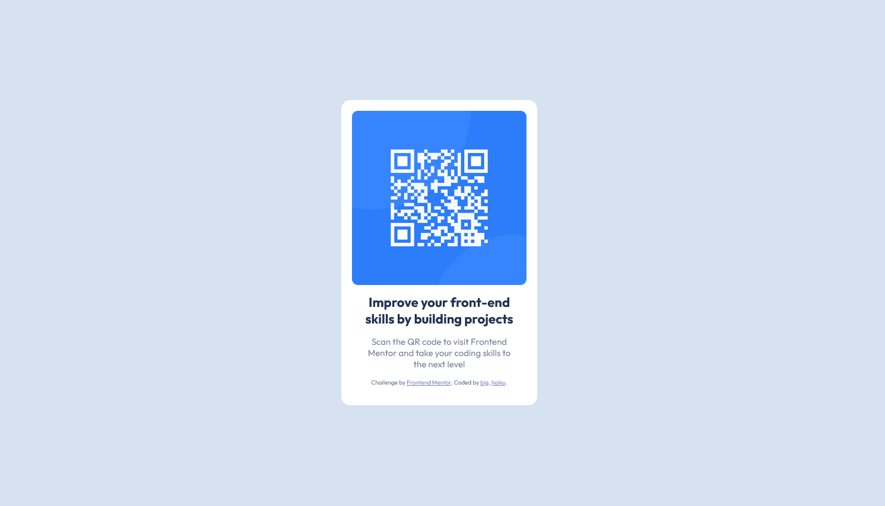

# Frontend Mentor - QR code component solution

This is a solution to the [QR code component challenge on Frontend Mentor](https://www.frontendmentor.io/challenges/qr-code-component-iux_sIO_H). Frontend Mentor challenges help you improve your coding skills by building realistic projects.

## Table of contents

- [Overview](#overview)
  - [Screenshot](#screenshot)
  - [Links](#links)
- [My process](#my-process)
  - [Built with](#built-with)
  - [What I learned](#what-i-learned)
  - [Continued development](#continued-development)
- [Author](#author)
- [Acknowledgments](#acknowledgments)

## Overview

### Screenshot



### Links

- Git Repo: (https://github.com/big-haiku/Frontend-Mentor-QRcode-Challenge)
- Live Site URL: (https://big-haiku.github.io/Frontend-Mentor-QRcode-Challenge/)

## My process

### Built with

- Semantic HTML5 markup
- CSS custom properties
- Flexbox
- Mobile-first workflow (mobile-only workflow to be fair, the design images didn't require a desktop layout)
- style-guide.md - For styles

### What I learned

While I feel I have the fundamentals of CSS/HTML down, this challenge helped me to reinforce them, and refine my more simple processes. Notably, not using a div for everything and instead varying my elements for easier readability.

I'm feeling good about my CSS starting setup, and feel like I'm developing a good basis for how I start future projects.

```css
:root {
  --White: hsl(0, 0%, 100%);
  --Light-gray: hsl(212, 45%, 89%);
  --Grayish-blue: hsl(220, 15%, 55%);
  --Dark-blue: hsl(218, 44%, 22%);
}
* {
  box-sizing: border-box;
}
body {
  margin: 0;
  padding: 0;
  font-family: "Outfit", sans-serif;
  color: var(--Dark-blue);
  background-color: var(--Light-gray);
}
```

### Continued development

While this project didn't demand it, keeping in mind opportunities to push responsive design going forward would represent a big advancement from this challenge.

## Author

- Website - [big_haiku](https://www.your-site.com)
- Frontend Mentor - [@yourusername](https://www.frontendmentor.io/profile/yourusername)

## Acknowledgments

Thank you to Frontend Mentor for the challenge. Looking forward to more.
